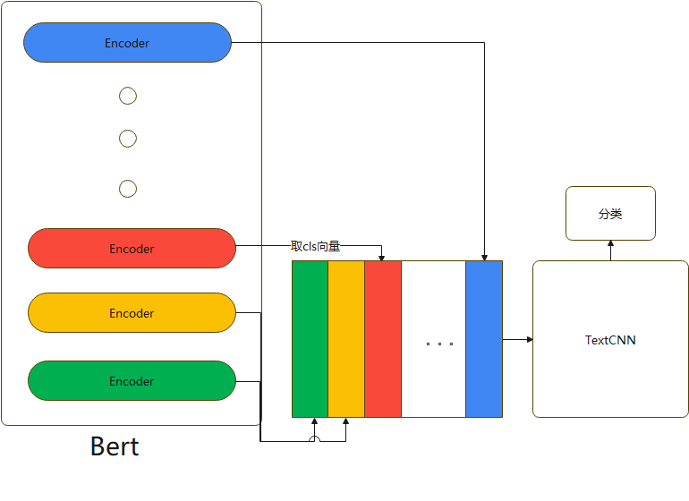
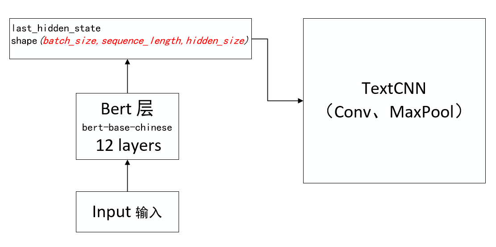

模型都未进行调参，未能使模型的准确率达到最高
使用 Bert + TextCNN 融合模型进行文本分类（中文）；英文同理；


Bert 往往可以对一些表述隐晦的句子进行更好的分类，TextCNN 往往对关键词更加敏感。

# bert-TextCNN 模型结构图
## 模型1
        
Bert-Base 除去第一层输入层，有 12 个 encoder 层，每个 encode 层的第一个 token（CLS）向量都可以当作句子向量，
可以抽象的理解为：encode 层越浅，句子向量越能代表低级别语义信息，越深，代表更高级别语义信息。
目的是既想得到有关词的特征，又想得到语义特征，模型具体做法是将第 1 层到第 12 层的 CLS 向量，作为 TextCNN 的输入，进行文本分类

## 模型2

将 bert 模型的最后一层的输出的内容作为 TextCNN 模型的输入，送入模型在继续进行学习，得到最终的结果，进行文本分类


在配置文件中修改长度、类别数、预训练模型地址    
```
parser.add_argument("--last_layer_only", type=bool, default=True, help="选择模型")
parser.add_argument("--model_name_or_path", type=str, default="./bert-base-chinese", help="bert 预训练模型")
parser.add_argument("--class_num", type=int, default=10)   
parser.add_argument("--max_len", type=int, default=38)
```

