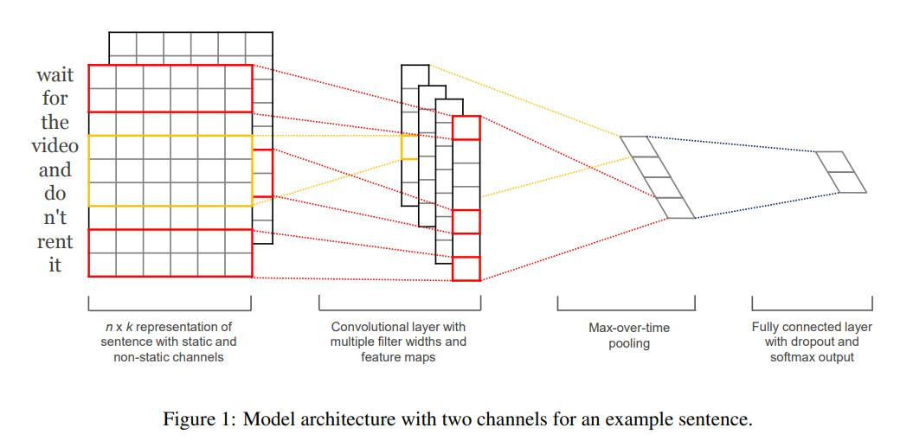
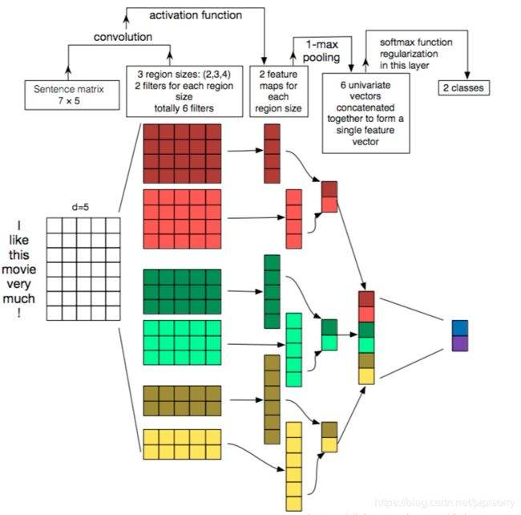

模型都未进行调参，未能使模型的准确率达到最高
使用 TextCNN 模型来对中文进行分类，即文本分类

# TextCNN 模型结构图

输入一句话：I like this movie very mush!，将其向量化，得到维度为5的矩阵，其 shape 为[1, 7, 5]。
将其送入模型，先经过3个卷积，卷积核大小分别为（2,5)，(3,5)，(4,5)。得到的 feature_map 的 shape 为 [1, 6]，[1, 5]，[1,4]。
将得到的 feature_map 经过最大池化，得到 feature_map 的 shape 为 [1, 2]，[1, 2]，[1, 2]。
将池化后的 feature_map 进行拼接，得到的 shape 为 [1,6]，最后将其分为 2 分类。
**注：每个 shape 中的第一维度均为 batch_size。这里是以论文为主，所有为 1 ，实际不为 1。**

# 项目数据集
数据集使用THUCNews中的train.txt、test.txt、dev.txt，为十分类问题。
其中训练集一共有 180000 条，验证集一共有 10000 条，测试集一共有 10000 条。
其类别为 finance、realty、stocks、education、science、society、politics、sports、game、entertainment 这十个类别。

# 模型训练
`python main.py`

